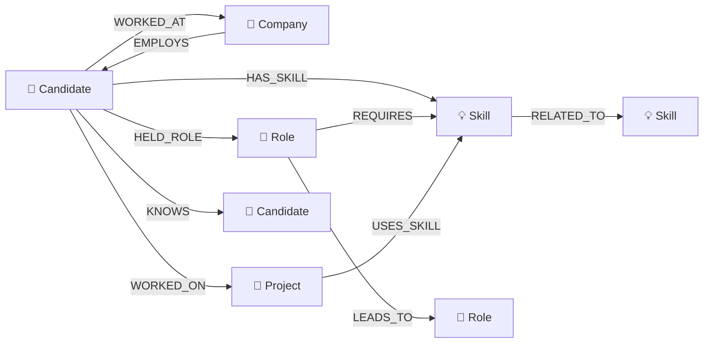

# TalentGraph — Professional Network & Talent Discovery Platform

[](https://nextjs.org/)
[](https://cognodb.com/)
[](https://tailwindcss.com/)
[](https://neo4j.com/developer/javascript/)
[](https://opensource.org/licenses/MIT)

**TalentGraph** is an enterprise-grade talent discovery and professional network intelligence platform powered by **CognoDB** graph database. Built on modern web technologies, TalentGraph transforms flat resume databases into an interconnected knowledge graph, enabling recruiters, hiring managers, and professionals to navigate complex multi-hop referral networks, discover hidden talent pathways, perform deep skill gap analyses, and trace optimal career progressions in real time.

---

## 🌐 Live Hosted Demo & Screen Recording

- **Live Application Demo**: Hosted on Vercel / Cloud: [https://talentgraph-demo.vercel.app](https://talentgraph-demo.vercel.app) *(or your deployed URL)*
- **Video Walkthrough & Presentation**: [Watch the Screen Recording & Demo](https://talentgraph-demo.vercel.app/demo-video)

---

## 🎯 Why a Graph Database?

Relational databases (RDBMS) model data in tabular rows and columns, requiring costly Cartesian products and foreign key JOIN operations to connect entities. In contrast, talent discovery, organizational hierarchies, and professional relationships are **inherently graph-structured**. 

Here is why a native graph database like **CognoDB** is fundamentally superior for talent intelligence:

1. **Inherent Graph Topology**: Professional relationships naturally form networks — candidates know other candidates, who work at companies, which require specific skills, which lead to career advancements (`Candidate -> KNOWS -> Candidate -> WORKED_AT -> Company`).
2. **Effortless Multi-Hop Traversals**: Finding 2nd and 3rd-degree connections or hidden referral chains is a succinct `[:KNOWS*1..3]` pattern in Cypher, whereas SQL requires cumbersome, resource-heavy recursive Common Table Expressions (CTEs).
3. **Graph-Native Shortest Path Calculation**: Tracing optimal career pathways between roles is a single built-in `shortestPath()` call in Cypher, avoiding exponential self-joins in relational engines.
4. **Natural Skill Neighborhood & Gap Analysis**: Skill dependencies, prerequisites, and overlaps map directly to graph neighborhoods, making candidate-to-role matching intuitive and fast.
5. **Expressive Pattern Matching**: Queries like *"Find engineers who worked at Company X and know someone at Company Y with Skill Z"* are written declaratively in Cypher with zero performance degradation compared to 5-table relational joins.
6. **Agile Schema Evolution**: Adding new entities (e.g., certifications, mentorships, publications) or relationship properties requires no disruptive `ALTER TABLE` locks or schema migrations.

### Cypher vs. SQL Query Comparison

#### Example 1: Finding 2nd & 3rd Degree Connections with a Specific Skill

**openCypher (CognoDB / Neo4j):**
```cypher
MATCH (c:Candidate {id: $candidateId})-[:KNOWS*2..3]-(peer:Candidate)-[:HAS_SKILL]->(s:Skill {name: $skillName})
WHERE NOT (c)-[:KNOWS]-(peer) AND peer.id <> $candidateId
RETURN DISTINCT peer.name, peer.title, peer.location;
```

**Equivalent SQL (Relational Database with Recursive CTE):**
```sql
WITH RECURSIVE candidate_network AS (
  -- Anchor member (1st degree)
  SELECT 
    k.candidate_b_id AS candidate_id, 
    1 AS depth, 
    ARRAY[k.candidate_a_id, k.candidate_b_id] AS path
  FROM candidate_connections k
  WHERE k.candidate_a_id = :candidateId
  
  UNION ALL
  
  -- Recursive member (2nd and 3rd degrees)
  SELECT 
    k.candidate_b_id, 
    cn.depth + 1, 
    path || k.candidate_b_id
  FROM candidate_connections k
  JOIN candidate_network cn ON k.candidate_a_id = cn.candidate_id
  WHERE cn.depth < 3 
    AND NOT (k.candidate_b_id = ANY(cn.path))
)
SELECT DISTINCT c.name, c.title, c.location
FROM candidate_network cn
JOIN candidates c ON c.id = cn.candidate_id
JOIN candidate_skills cs ON cs.candidate_id = c.id
JOIN skills s ON s.id = cs.skill_id
WHERE cn.depth BETWEEN 2 AND 3
  AND s.name = :skillName
  AND cn.candidate_id NOT IN (
    SELECT candidate_b_id FROM candidate_connections WHERE candidate_a_id = :candidateId
  );
```

#### Example 2: Shortest Path Role Progression

**openCypher (CognoDB):**
```cypher
MATCH (start:Role {id: $fromRoleId}), (end:Role {id: $toRoleId})
MATCH path = shortestPath((start)-[:LEADS_TO*]->(end))
RETURN [n IN nodes(path) | n.name] AS steps, length(path) AS totalHops;
```

**Equivalent SQL (Relational Database):**
```sql
WITH RECURSIVE role_path AS (
  SELECT r.id, r.name, 0 AS hops, ARRAY[r.id] AS visited
  FROM roles r WHERE r.id = :fromRoleId
  UNION ALL
  SELECT next_r.id, next_r.name, rp.hops + 1, visited || next_r.id
  FROM role_progressions p
  JOIN role_path rp ON p.from_role_id = rp.id
  JOIN roles next_r ON next_r.id = p.to_role_id
  WHERE NOT (next_r.id = ANY(rp.visited))
)
SELECT visited, hops FROM role_path WHERE id = :toRoleId ORDER BY hops ASC LIMIT 1;
```

---

## 📊 Graph Data Model

The TalentGraph knowledge graph comprises candidates, skills, companies, roles, and projects interconnected through richly attributed relationships:



### Node Labels & Attributes

| Node Label | Key Properties | Description |
| :--- | :--- | :--- |
| `:Candidate` | `id`, `name`, `title`, `location`, `experience`, `email`, `about` | Individual talent profiles |
| `:Skill` | `id`, `name`, `category` (Frontend, Backend, Database, DevOps, AI, Design, Leadership) | Technical and soft skills |
| `:Company` | `id`, `name` | Employers and client organizations |
| `:Role` | `id`, `name`, `department` | Standardized organizational positions |
| `:Project` | `id`, `name`, `desc` | Key projects and initiatives |

### Relationship Types & Properties

| Relationship | Source Node | Target Node | Properties | Semantics |
| :--- | :--- | :--- | :--- | :--- |
| `HAS_SKILL` | `:Candidate` | `:Skill` | `proficiency` (1-5) | Candidate capability & verified mastery |
| `WORKED_AT` | `:Candidate` | `:Company` | `role`, `startYear`, `endYear` | Employment history timeline |
| `HELD_ROLE` | `:Candidate` | `:Role` | `title` | Organizational position held |
| `WORKED_ON` | `:Candidate` | `:Project` | `role` | Project delivery track record |
| `KNOWS` | `:Candidate` | `:Candidate` | - | Professional network referral link |
| `REQUIRES` | `:Role` | `:Skill` | `importance` ('High', 'Medium') | Role competency prerequisites |
| `LEADS_TO` | `:Role` | `:Role` | - | Career promotion ladder |
| `RELATED_TO` | `:Skill` | `:Skill` | - | Skill taxonomy proximity |

---

## 🚀 Key Features

1. **Dashboard & Topology KPIs**: Real-time network statistics (Nodes, Edges, Candidates, Skills, Companies), database connectivity badge, and quick action workflows.
2. **Interactive Graph Explorer**: Force-directed Canvas graph (`react-force-graph-2d`) with node-type filtering (Candidates, Skills, Companies, Roles), search, zoom, and deep node inspector panel.
3. **Candidate Directory & Profiles**: Instant search with debounced text matching, skill filters, and rich candidate profile pages showcasing their personal 1st/2nd-degree network neighborhood.
4. **Career Path Finder**: Calculates optimal career progression ladders using Cypher's native `shortestPath((a)-[:LEADS_TO*]->(b))` with prerequisite skill requirements at each milestone.
5. **Skill Gap & Readiness Analysis**: Diffs candidate capabilities against target role requirements to compute match percentages and personalized upskilling roadmaps.
6. **Live Cypher Playground**: Interactive query editor allowing users to execute openCypher queries live against CognoDB, measure execution latency in milliseconds, and inspect relational SQL comparisons.

---

## 🛠️ Technology Stack & Architecture

```
                                  ┌───────────────────────────────┐
                                  │   Next.js 14 App Router UI    │
                                  │   (React, Tailwind CSS, etc.) │
                                  └──────────────┬────────────────┘
                                                 │ HTTP / JSON
                                                 ▼
                                  ┌───────────────────────────────┐
                                  │    Next.js API Route Layer    │
                                  │ (/api/stats, /api/graph, ...) │
                                  └──────────────┬────────────────┘
                                                 │
                                                 ▼
                                  ┌───────────────────────────────┐
                                  │  Graph Service & Query Layer  │
                                  │   (Parameterized openCypher)  │
                                  └──────────────┬────────────────┘
                                                 │ Bolt Protocol 5.x
                                                 ▼
 ┌──────────────────────────────┐                ┌──────────────────────────────┐
 │   Simulated Fallback Mode    │ ◄───────────── │  Official neo4j-driver 5.x   │
 │   (Offline/Demo Readiness)   │   (if unreach) └──────────────┬───────────────┘
 └──────────────────────────────┘                               │ Bolt+s://
                                                                ▼
                                                 ┌──────────────────────────────┐
                                                 │   CognoDB Cloud Database     │
                                                 │   (console.cognodb.com)      │
                                                 └──────────────────────────────┘
```

- **Database Layer**: **CognoDB Cloud** (openCypher over Bolt protocol 5.0–5.4).
- **Driver**: Official `neo4j-driver` (JavaScript / Node.js).
- **Backend**: Next.js 14 App Router (Node.js runtime, parameterized queries).
- **Frontend**: React 18, Tailwind CSS, Lucide React icons.
- **Graph Visualization**: HTML5 Canvas Force-Directed Engine (`react-force-graph-2d`).

---

## ⚙️ Setup & Installation Guide

### 1. Prerequisites
- Node.js 18+ installed on your machine (`node -v`).
- A free **CognoDB Cloud** database instance.

### 2. Create your CognoDB Cloud Database
1. Go to [https://console.cognodb.com/signup](https://console.cognodb.com/signup) and create a free account (no credit card required).
2. Click **Create Instance** -> select the Free (c0) tier and choose your preferred region.
3. Copy your Connection URI (e.g. `bolt+s://<instance-id>.databases.cognodb.cloud`) and save the generated password for the default user `cognodb`.

### 3. Clone and Configure Environment
Clone the repository and copy the environment template:
```bash
git clone https://github.com/your-username/talentgraph.git
cd talentgraph
cp .env.example .env.local
```

Edit `.env.local` with your CognoDB credentials:
```env
COGNODB_URI=bolt+s://<your-instance-id>.databases.cognodb.cloud
COGNODB_USER=cognodb
COGNODB_PASSWORD=<your-saved-password>
```

### 4. Install Dependencies & Seed the Database
```bash
# 1. Install packages
npm install

# 2. Seed realistic talent graph dataset into CognoDB
npm run seed
```

### 5. Run the Local Development Server
```bash
npm run dev
```

Open [http://localhost:3000](http://localhost:3000) in your browser to explore TalentGraph!

---

## 🔍 Core Cypher Queries Explained

### 1. Candidate Directory Search with Skill Aggregation
```cypher
MATCH (c:Candidate)
WHERE ($name IS NULL OR toLower(c.name) CONTAINS toLower($name) OR toLower(c.title) CONTAINS toLower($name))
WITH c
OPTIONAL MATCH (c)-[r:HAS_SKILL]->(s:Skill)
WHERE ($skill IS NULL OR toLower(s.name) = toLower($skill) OR toLower(s.id) = toLower($skill))
WITH c, count(s) AS matchedSkillCount, collect({id: s.id, name: s.name, proficiency: coalesce(r.proficiency, 3)}) AS skills
WHERE ($skill IS NULL OR matchedSkillCount > 0)
RETURN c.id AS id, c.name AS name, c.title AS title, c.location AS location, 
       c.experience AS experience, c.email AS email, c.about AS about, skills
ORDER BY c.name ASC
LIMIT 50;
```

### 2. Multi-Hop Graph Traversal (1 to 3 Degrees of Separation)
```cypher
MATCH (start:Candidate {id: $id})
MATCH path = (start)-[:KNOWS*1..3]-(c:Candidate)
WHERE c <> start
WITH c, min(length(path)) AS distance
ORDER BY distance ASC, c.name ASC
OPTIONAL MATCH (c)-[r:HAS_SKILL]->(s:Skill)
RETURN c.id AS id, c.name AS name, c.title AS title, c.location AS location,
       distance, collect(DISTINCT {name: s.name, proficiency: r.proficiency}) AS skills
LIMIT 30;
```

### 3. Career Path Optimization (Shortest Path)
```cypher
MATCH (start:Role {id: $fromRoleId}), (end:Role {id: $toRoleId})
MATCH path = shortestPath((start)-[:LEADS_TO*]->(end))
RETURN [n IN nodes(path) | n { .*, requiredSkills: [(n)-[:REQUIRES]->(s:Skill) | s.name] }] AS pathNodes,
       length(path) AS length;
```

### 4. Skill Gap & Role Readiness Matrix
```cypher
MATCH (r:Role {id: $roleId})-[:REQUIRES]->(req:Skill)
OPTIONAL MATCH (c:Candidate {id: $candidateId})-[hs:HAS_SKILL]->(req)
RETURN req.id AS skillId, req.name AS skillName, req.category AS category,
       CASE WHEN hs IS NOT NULL THEN true ELSE false END AS hasSkill,
       coalesce(hs.proficiency, 0) AS currentProficiency,
       coalesce(req.importance, 'High') AS importance
ORDER BY req.category, req.name;
```

---

## 🚢 Deployment (Vercel)

TalentGraph is optimized for zero-configuration deployment on Vercel:

1. Push your code to a GitHub repository.
2. Import the project into [Vercel](https://vercel.com).
3. Add Environment Variables in the Vercel project settings:
   - `COGNODB_URI`
   - `COGNODB_USER`
   - `COGNODB_PASSWORD`
4. Click **Deploy**!

---

## 📄 License

This project is licensed under the MIT License — see the [LICENSE](LICENSE) file for details.
